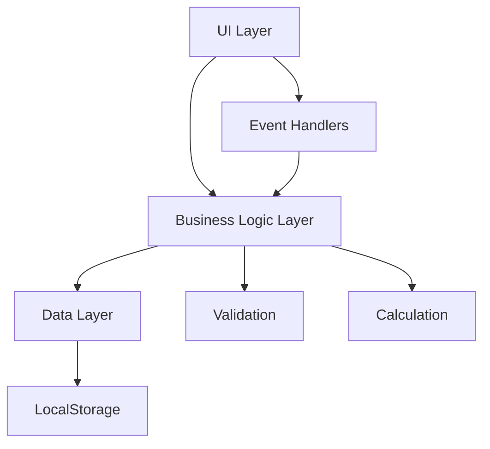

# Design Document: Expense Tracker

## Overview

The Expense Tracker is a client-side web application built with vanilla JavaScript, HTML, and CSS. The application provides a simple, intuitive interface for users to manage their personal expenses without requiring a backend server or database. All data is persisted locally in the browser's localStorage, making it a lightweight, privacy-focused solution.

The architecture follows a modular approach with clear separation between data management, UI rendering, and business logic. The application is designed to be responsive and accessible, providing immediate feedback for all user actions.

## Architecture

The application follows a simple layered architecture:



### Layers

1. **UI Layer**: Handles rendering of expenses, forms, and user interactions
   - Renders expense list with formatting
   - Manages form inputs and controls
   - Displays totals and filter controls
   - Provides visual feedback for errors

2. **Business Logic Layer**: Implements core functionality
   - Expense validation (amount, description, category)
   - Total calculation
   - Filtering logic
   - Date formatting

3. **Data Layer**: Manages expense data and persistence
   - CRUD operations for expenses
   - LocalStorage serialization/deserialization
   - Data retrieval and querying

## Components and Interfaces

### Expense Model

```javascript
interface Expense {
  id: string;           // Unique identifier (UUID or timestamp-based)
  amount: number;       // Positive decimal number
  description: string;  // Non-empty string
  category: Category;   // One of the predefined categories
  date: string;         // ISO 8601 date string (YYYY-MM-DD)
}

type Category = 
  | "Food" 
  | "Transport" 
  | "Entertainment" 
  | "Utilities" 
  | "Healthcare" 
  | "Other";
```

### ExpenseStore

The ExpenseStore manages all expense data and persistence operations.

```javascript
class ExpenseStore {
  // Load all expenses from localStorage
  loadExpenses(): Expense[]
  
  // Save all expenses to localStorage
  saveExpenses(expenses: Expense[]): void
  
  // Add a new expense
  addExpense(expense: Omit<Expense, 'id'>): Expense
  
  // Delete an expense by ID
  deleteExpense(id: string): boolean
  
  // Get all expenses
  getAllExpenses(): Expense[]
  
  // Get expenses filtered by category
  getExpensesByCategory(category: Category | "All"): Expense[]
}
```

### ExpenseValidator

Validates expense data before creation.

```javascript
class ExpenseValidator {
  // Validate amount is positive
  validateAmount(amount: number): ValidationResult
  
  // Validate description is non-empty
  validateDescription(description: string): ValidationResult
  
  // Validate category is valid
  validateCategory(category: string): ValidationResult
  
  // Validate complete expense object
  validateExpense(expense: Partial<Expense>): ValidationResult
}

interface ValidationResult {
  valid: boolean;
  error?: string;
}
```

### ExpenseCalculator

Handles calculations related to expenses.

```javascript
class ExpenseCalculator {
  // Calculate total of all expenses
  calculateTotal(expenses: Expense[]): number
  
  // Calculate total for filtered expenses
  calculateFilteredTotal(expenses: Expense[], category: Category | "All"): number
}
```

### ExpenseRenderer

Manages UI rendering and updates.

```javascript
class ExpenseRenderer {
  // Render the complete expense list
  renderExpenseList(expenses: Expense[]): void
  
  // Render a single expense item
  renderExpenseItem(expense: Expense): HTMLElement
  
  // Update the total display
  renderTotal(total: number): void
  
  // Render empty state message
  renderEmptyState(): void
  
  // Format currency for display
  formatCurrency(amount: number): string
  
  // Format date for display
  formatDate(dateString: string): string
}
```

## Data Models

### Storage Schema

Expenses are stored in localStorage under the key `expense-tracker-data` as a JSON array:

```json
[
  {
    "id": "1234567890",
    "amount": 45.50,
    "description": "Grocery shopping",
    "category": "Food",
    "date": "2024-01-15"
  },
  {
    "id": "1234567891",
    "amount": 12.00,
    "description": "Bus fare",
    "category": "Transport",
    "date": "2024-01-15"
  }
]
```

### Data Flow

1. **Adding an Expense**:
   - User fills form → Validation → Create Expense object → Add to store → Save to localStorage → Update UI

2. **Deleting an Expense**:
   - User clicks delete → Remove from store → Save to localStorage → Update UI

3. **Filtering Expenses**:
   - User selects category → Filter expenses in memory → Update UI with filtered list → Update total

4. **Loading Application**:
   - Application starts → Load from localStorage → Parse JSON → Render UI

### ID Generation

Expense IDs are generated using `Date.now() + Math.random()` to ensure uniqueness within the client session. This is sufficient for a single-user, client-side application.


## Correctness Properties

A property is a characteristic or behavior that should hold true across all valid executions of a system—essentially, a formal statement about what the system should do. Properties serve as the bridge between human-readable specifications and machine-verifiable correctness guarantees.

### Property Reflection

After analyzing all acceptance criteria, I identified several redundancies:
- Properties 3.1 and 3.2 both test deletion - combined into one property
- Property 4.2 is redundant with 1.4 (category validation) - removed
- Properties 6.1, 6.2, and 6.3 all test persistence - combined into round-trip properties
- Property 5.2 is an invariant that should always hold - merged with 5.1

### Core Properties

**Property 1: Valid expense addition**
*For any* valid expense data (positive amount, non-empty description, valid category, valid date), adding it to the expense tracker should result in the expense appearing in the expense list.
**Validates: Requirements 1.1**

**Property 2: Invalid amount rejection**
*For any* non-positive number (negative or zero), attempting to add an expense with that amount should be rejected and the expense list should remain unchanged.
**Validates: Requirements 1.2**

**Property 3: Empty description rejection**
*For any* string composed entirely of whitespace or empty string, attempting to add an expense with that description should be rejected and the expense list should remain unchanged.
**Validates: Requirements 1.3**

**Property 4: Invalid category rejection**
*For any* invalid category value (null, undefined, empty string, or string not in the predefined category list), attempting to add an expense with that category should be rejected and the expense list should remain unchanged.
**Validates: Requirements 1.4**

**Property 5: Form clearing after addition**
*For any* valid expense, after successfully adding it, all form input fields should be cleared to their default empty or initial state.
**Validates: Requirements 1.5**

**Property 6: Reverse chronological ordering**
*For any* list of expenses with different dates, when displayed, they should be ordered from most recent to oldest date.
**Validates: Requirements 2.1**

**Property 7: Complete expense rendering**
*For any* expense, the rendered output should contain the expense's amount, description, category, and date.
**Validates: Requirements 2.2**

**Property 8: Currency formatting**
*For any* expense amount, when displayed, it should be formatted with exactly two decimal places.
**Validates: Requirements 2.4**

**Property 9: Expense deletion**
*For any* expense in the list, deleting it should result in that expense no longer appearing in the expense list.
**Validates: Requirements 3.1, 3.2**

**Property 10: Total calculation correctness**
*For any* list of expenses, the displayed total should equal the sum of all expense amounts, and this should hold after any addition or deletion operation.
**Validates: Requirements 5.1, 5.2**

**Property 11: Persistence round-trip**
*For any* list of expenses, after saving to localStorage and then loading from localStorage, the retrieved list should contain the same expenses with the same data.
**Validates: Requirements 6.1, 6.2, 6.3**

**Property 12: Category filtering correctness**
*For any* category filter selection, the displayed expenses should include only expenses matching that category, and when "All Categories" is selected, all expenses should be displayed.
**Validates: Requirements 7.2, 7.3**

**Property 13: Filtered total correctness**
*For any* active category filter, the displayed total should equal the sum of only the filtered expenses.
**Validates: Requirements 7.4**

**Property 14: Future date acceptance**
*For any* date in the future, the expense tracker should accept it as a valid date for an expense.
**Validates: Requirements 8.3**

**Property 15: Date formatting**
*For any* valid date string, when displayed, it should be formatted in a consistent, readable format (MM/DD/YYYY or DD/MM/YYYY).
**Validates: Requirements 8.4**

### Edge Cases

The following edge cases should be explicitly tested in unit tests:

- Empty expense list displays appropriate message (Requirements 2.3)
- Empty expense list shows total of zero (Requirements 5.3)
- Application initializes correctly with empty localStorage (Requirements 6.4)

## Error Handling

### Validation Errors

The application should provide clear, user-friendly error messages for validation failures:

- **Invalid Amount**: "Amount must be greater than zero"
- **Empty Description**: "Description is required"
- **Missing Category**: "Please select a category"
- **Invalid Date**: "Please enter a valid date"

Error messages should be displayed near the relevant form field and cleared when the user corrects the input.

### Storage Errors

If localStorage is unavailable or full:
- Display a warning message to the user
- Continue operating with in-memory storage only
- Warn that data will not persist across sessions

### Data Corruption

If localStorage contains invalid JSON or corrupted data:
- Log the error to console
- Initialize with an empty expense list
- Optionally offer to backup/export the corrupted data

## Testing Strategy

### Dual Testing Approach

The application will use both unit tests and property-based tests to ensure comprehensive coverage:

**Unit Tests** focus on:
- Specific examples demonstrating correct behavior
- Edge cases (empty lists, zero totals, empty storage)
- Error conditions and validation
- UI integration points
- Date formatting edge cases

**Property-Based Tests** focus on:
- Universal properties that hold for all inputs
- Validation rules across many random inputs
- Calculation correctness with random data
- Round-trip persistence with random expense lists
- Filtering and sorting with random data sets

### Property-Based Testing Configuration

We will use **fast-check** (for JavaScript) as the property-based testing library. Each property test will:
- Run a minimum of 100 iterations to ensure thorough coverage
- Include a comment tag referencing the design property
- Tag format: `// Feature: expense-tracker, Property N: [property description]`

Example:
```javascript
// Feature: expense-tracker, Property 1: Valid expense addition
test('adding valid expenses increases list size', () => {
  fc.assert(
    fc.property(validExpenseArbitrary, (expense) => {
      const store = new ExpenseStore();
      const initialCount = store.getAllExpenses().length;
      store.addExpense(expense);
      expect(store.getAllExpenses().length).toBe(initialCount + 1);
    }),
    { numRuns: 100 }
  );
});
```

### Test Organization

Tests will be organized by component:
- `ExpenseStore.test.js` - Data layer and persistence tests
- `ExpenseValidator.test.js` - Validation logic tests
- `ExpenseCalculator.test.js` - Calculation tests
- `ExpenseRenderer.test.js` - Rendering and formatting tests
- `integration.test.js` - End-to-end workflow tests

### Coverage Goals

- Minimum 90% code coverage
- All 15 correctness properties implemented as property-based tests
- All edge cases covered by unit tests
- All error conditions tested

## Implementation Notes

### Technology Stack

- **HTML5**: Semantic markup for accessibility
- **CSS3**: Responsive design with mobile-first approach
- **Vanilla JavaScript (ES6+)**: No framework dependencies
- **LocalStorage API**: Client-side persistence
- **fast-check**: Property-based testing library
- **Jest** or **Vitest**: Test runner

### Browser Compatibility

Target modern browsers with localStorage support:
- Chrome 4+
- Firefox 3.5+
- Safari 4+
- Edge (all versions)
- Opera 10.5+

### Accessibility Considerations

- Semantic HTML elements (form, button, list)
- ARIA labels for screen readers
- Keyboard navigation support
- Focus management for form interactions
- Color contrast meeting WCAG AA standards
- Error messages announced to screen readers

### Performance Considerations

- Efficient rendering: Only re-render changed elements
- Debounce filter operations if needed
- Limit localStorage writes to actual data changes
- Consider pagination if expense list grows very large (>1000 items)

### Future Enhancements

Potential features for future iterations:
- Export expenses to CSV
- Date range filtering
- Monthly/yearly spending summaries
- Budget tracking and alerts
- Multiple currency support
- Expense editing capability
- Search functionality
